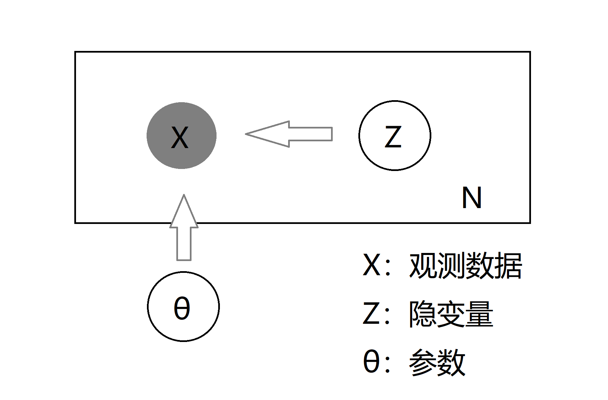
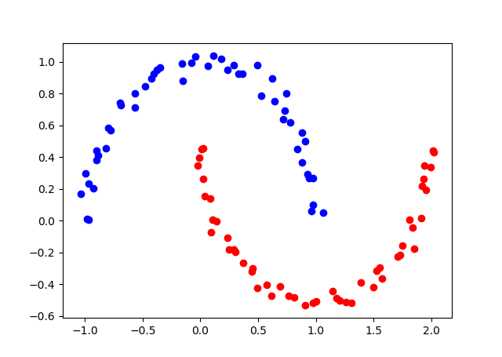
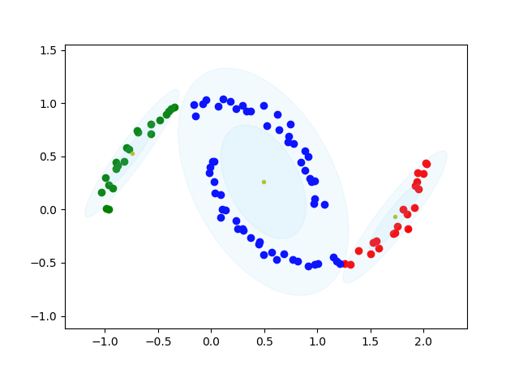
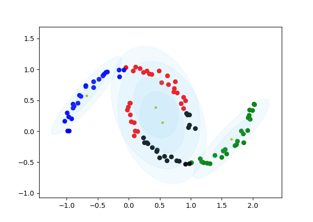
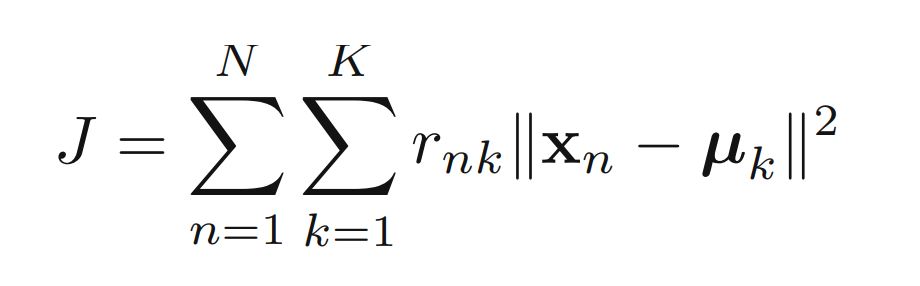

# 聚类算法
聚类属于无监督学习范畴，在没有标注的情况下，将数据划分成K类，使得类内距离最小，类间距离最大，形成团簇(cluster)。聚类算法可以看成生成式模型，存在一个离散隐变量Z(类别)，控制着观测数据X的生成，对应的概率图如下所示：

GMM和K-means两种聚类算法都可以用该概率图表示，其中K-means可以看作GMM的特例，两者都用EM算法优化，并且M步都有闭式解。

## 一、高斯混合模型(GMM)
## 1. 简介
高斯混合模型认为观测变量x|θ服从混合高斯分布，隐变量z服从Categorical分布，x|z,θ 服从高斯分布。其中待优化参数θ代表高斯分布均值、协方差矩阵、和混合系数的集合。
使用最大似然估计进行参数估计，即 θ* = argmax logP(X|θ)。 
## 2. EM算法
EM算法是对具有隐变量(latent variables)或者未观测数据变量(unobserved variables)的模型进行极大似然估计的常用技术，GMM采用EM(Expectation Maximization)优化算法求解最优参数θ。EM算法分为E步和M步，其中E步需要求关于隐变量z的后验概率P(z|x, θt)，M步需要极大化Q(θ|θt)函数，两者交替直至似然函数收敛或者参数收敛。EM算法也可用来求最大后验估计(MAP)，只需要在M步将待优化函数变成Q(θ|θt) + log P(θ) 具体参考 Christopher M. Bishop的PRML书籍第九章。
## 3. 效果
#### 1.数据

#### 2.聚类数K = 3

#### 3.聚类数K = 4

## 二、K-means聚类算法
## 1. 简介
### 1.1 优化视角
K-means算法可以理解为优化如下目标函数:

其中μk和rnk是待优化变量，K-means算法采取先固定rnk优化μk，再固定μk优化rnk，两者交替进行使得目标函数在每一步都可以减小直至收敛。

### 1.2 概率视角
从概率角度理解K-means聚类算法，K-means可以看成GMM的特例，满足:
1. 正态分布的协方差矩阵是εI(I是单位矩阵)
2. 当ε-->0时，关于隐变量的后验概率z|x, θ服从dirac Delta分布，在最近的第K个团簇概率为1，其余为0。

## 2. EM算法
K-means算法同样可以看成使用EM算法进行优化，其中E步求隐变量z后验概率，相当于对样本指标集对当前μ进行了一个划分； 而M步最大化Q函数即用划分的数据点的均值作为新的μ。

## 3. 效果
#### 1. 数据

#### 2. 聚类数k = 3

## 三、总结
1. 从效果对比可以看出，k-means的聚类边界是圆形，而GMM的聚类边界则是椭圆，这是由协方差矩阵决定的。
2. 在参数初始值方面，EM算法只能保证收敛到稳定点，因此初始点的选择十分重要。这里采用最远点采样技术(farthest point sampling，FPS)进行初始均值的选择，FPS是一种贪婪算法，除了初值随意采样之外，后面采样的点，都得保证其与已采样点集的haussdroff 距离最大。
3. K-means由于经过简化，相对于GMM速度更快，因此GMM初始均值常用K-means最终值赋予。
4. 在K值的选取方面，常用Elbow准则进行选取。
5. 比较K-means和GMM关于z后验概率的形式，我们一般称K-means是硬分配(hard assignment),GMM是软分配(soft assignment)。

## 四、参考资料
1. Bishop C M . Pattern Recognition and Machine Learning (Information Science and Statistics)[M]. Springer-Verlag New York, Inc. 2006.
2. [website](https://zhuanlan.zhihu.com/p/81255623)

## 五、补充
1. Fuzzy C Means(FCM) 聚类算法 [link](./FCM.md)

