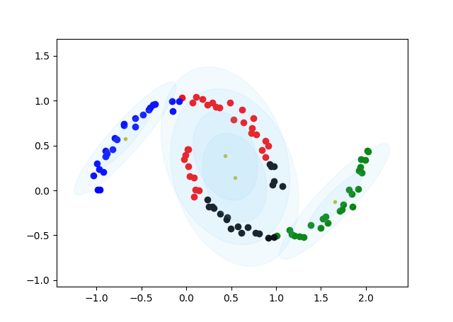

# 聚类算法
聚类属于无监督学习范畴，在没有标注的情况下，对数据进行划分(partition)。聚类算法可以看成生成式模型，存在一个不可观测的隐变量Z(类别)，控制着观测数据X的生成。这里介绍GMM和Kmeans两种聚类算法，Kmeans可以看作GMM的特例，都用EM算法优化，并且M步都有闭式解。

## 一、高斯混合模型(GMM)
## 1. 简介
高斯混合模型认为观测变量X|θ服从混合高斯分布，隐变量Z服从Categorical分布，x|z,θ 服从高斯分布。其中θ代表高斯分布均值、协方差矩阵、和混合系数的集合，它们都是待优化参数。
使用最大似然估计进行参数估计，即 θ* = argmax logP(X|θ)。 
## 2. EM算法
GMM采用EM(Expectation Maximization)优化算法求解最优参数θ，EM算法分为E步和M步，其中E步需要求关于隐变量z的后验概率P(z|x, θt)，M步需要极大化Q(θ|θt)函数。具体参考 Andrew Gelman 的
Bayesian Data Analysis 书籍。
## 3. 效果

## 二、Kmeans聚类
## 1. 简介
Kmeans算法可以看成GMM算法的特例，满足
1. 正态分布的协方差矩阵是单位矩阵
2. 混合系数相等
3. 认为样本归属于产生概率最大的那一个高斯分布， 即p(xi|θ) = N(xi|μk,Σk)， 隐变量Z的概率只能取1或0

## 2. EM算法
Kmeans算法同样可以看成使用EM算法进行优化，其中E步求隐变量z后验概率，相当于对样本指标集对当前μ进行了一个划分； 而M步最大化Q函数即用划分的数据点的均值作为新的μ。

## 3. 效果

## 三、总结
1. 从效果对比可以看出，kmeans的分类边界是圆形，本质上就是其认为高斯分布协方差矩阵是单位矩阵，而GMM的分类边界则是椭圆。
2. GMM和Kmeans均需要设定聚类的个数K和参数初始值，由于EM算法只能保证收敛到稳定点，因此初始点的选择十分重要。这里采用最远点采样技术(farthest point sampling，FPS)进行初始均值的选择，FPS是一种贪婪算法，除了初值随意采样之外，后面采样的点，都得保证其与已采样点集的haussdroff 距离最大。

## 四、参考
1. Gelman A , Carlin J B , Stern H S , et al. Bayesian Data Analysis, London[J]. Biometrics, 1996, 52(3).
2. [website](https://zhuanlan.zhihu.com/p/71574416)
3. [website](https://zhuanlan.zhihu.com/p/81255623)

