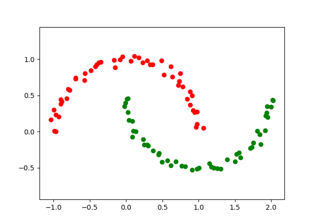
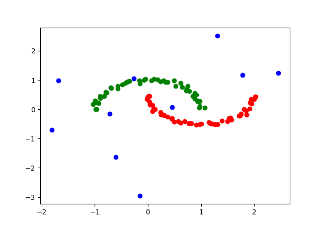
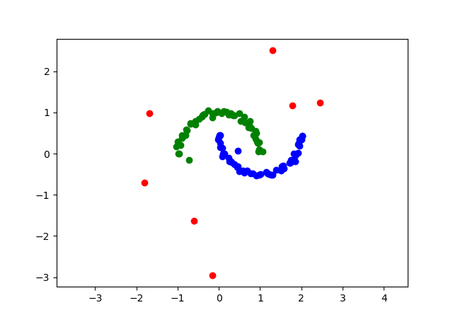

# DBSCAN 聚类算法
## 1. 简介
DBSCAN(Density-Based Spatial Clustering of Applications with Noise)是一种基于密度，对噪声具有鲁棒性的空间聚类算法。DBSCAN算法认为数据可以聚类成团簇，
是因为团簇内数据点的密度比团簇外的点的密度高得多。此外，噪声的密度比任何团簇的密度低得多。

### 1.1 DBSCAN算法参数和三种点
DBSCAN算法需要赋予两个参数，半径R和最小点数minPts。DBSCAN提出待聚类数据可以划分成三种点，分别是核心点(core point)、边界点(border point)和噪声点(noise point)。
其中点P被称为核心点当且仅当以该点为中心，R为半径的点数超过minPts。边界点指的是以该点为圆心，R为半径的点数小于minPts，但是该点属于某个团簇。
相应的，以该点为中心，R为半径的点数小于minPts且不属于任何团簇的点是噪声点。

****注意****:DBSCAN认为一个点是噪声的必要条件是它的密度小于参数定义的密度。

### 1.2 点之间的关系
DBSCAN论文中引入了三种关系，分别是：

1. 密度直达(directly density-reachable)
2. 密度可达(density-reachable)
3. 密度相连(density-connected)

具体定义参见DBSCAN论文，团簇中任意两个点之间都具有密度相连的关系。
密度相连是一个等价关系，DBSCAN就是用该等价关系将原始数据划分成若干等价类。

### 1.3 引理
在DBSCAN论文中有一个非常重要的引理，即从一个团簇的任何一个核心点出发，
该核心点所有密度可达的点构成的集合等于该团簇。这是DBSCAN算法设计的基础，
具体来说，可以用一个掩模标记已经访问过的核心点，然后用新的核心点作为种子点使用区域生长法找到关于
核心点所有密度可达的点。

该引理的**等价表述**:考虑一个团簇中所有核心点(Core point)组成的集合，若两个核心点之间具有密度直达关系则在两点之间加一条边，
最后构成一张图。一个团簇中所有核心点关于密度直达关系构成的图是连通的(connected)，即任意两个核心点之间都有路径。

## 2. 效果

1. 不加噪声数据 

2. 不加噪声结果, R = 0.3, minPts = 4

3. 加高斯噪声数据，标准差为1.5

4. 加噪声聚类结果

## 3. 总结
1. DBSCAN通过密度先验构造了数据之间的某种关系进行聚类，相对于GMM和K-means聚类算法，DBSCAN关于数据的假设要弱很多，
对于形状不规则的数据也能有较好的效果。
2. 与其他聚类算法不同的是，DBSCAN不用给出目标聚类个数，聚类的个数是通过调节半径和最小点数来调节的。
3. DBSCAN给出了一个非常直观的噪声的定义，通过DBSCAN可以自然地分出噪声点(或者说离群点)。
4. DBSCAN聚类算法有可能存在边界点(border point)同时属于多个团簇，这个时候该点会划分到第一个发现它的团簇，除了这种极少发生的情况，
DBSCAN算法的聚类结果是和数据点遍历的顺序无关的(引理保证)。
5. 网上有很多关于DBSCAN的教程，但相较而言都没有原始论文讲得仔细，DBSCAN不是一个启发式的聚类算法，它有着坚实的理论基础。

## 4. 参考
[1] Ester M . A Density-Based Algorithm for Discovering Clusters in Large Spatial Databases with Noise[J]. Proc.int.conf.knowledg Discovery & Data Mining, 1996.
