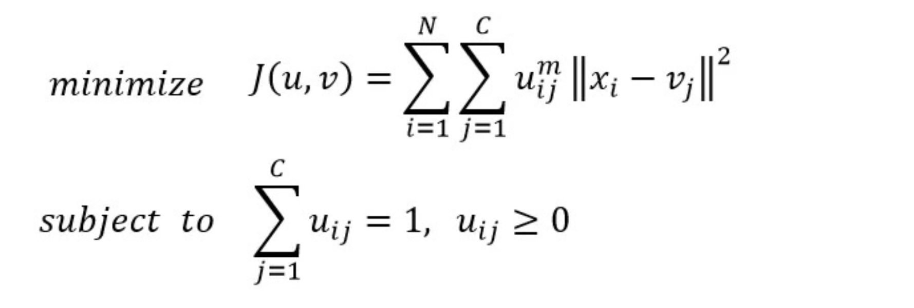
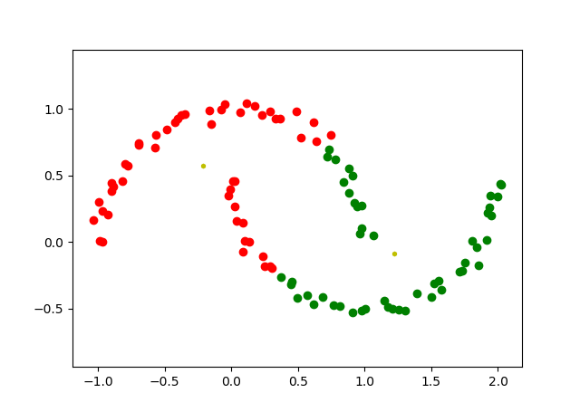
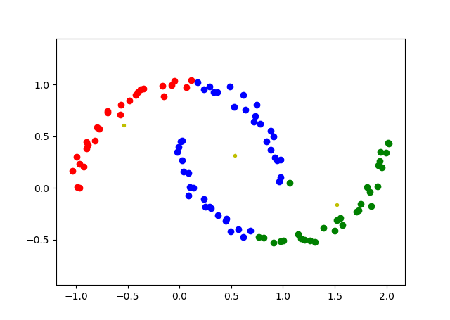
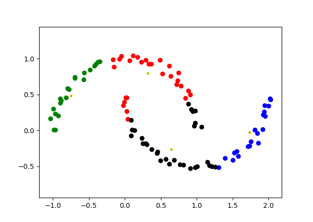

# FCM聚类算法
## 一、介绍
前面介绍的GMM和K-means聚类算法都可以看做用EM算法求解一个隐变量模型。FCM的出发点是改进K-means优化函数的形式，认为数据点不再是硬分配(hard assignment)取0或者1的形式，而是具有某种隶属度uij，
优化目标函数如下所示：

优化变量为均值vj和隶属度uij，其中uij的幂次m称为模糊系数(fuzzy coefficient)，和聚类数同为超参数。
FCM优化方式同样是交替优化，即固定一个变量优化另一个变量，交替进行至收敛，FCM每步优化和GMM一样都具有闭式解。

## 二、效果
### 1. 聚类个数为2， 模糊系数取3

### 2. 聚类个数为3， 模糊系数取3

### 3. 聚类个数为4， 模糊系数取3

# 三、总结
如果从概率的角度看FCM的话，可以将其目标函数看作EM算法中的Q函数，E步和M步分别对应着对隶属度进行优化和对每类均值进行优化。隶属度相当于对隐变量的后验概率。但是有一点不同的是，FCM没法表示成某种生成式模型的形式，因此它无法自然地通过后验概率预测新样本的类别。还有一点不同地是FCM的
参数个数随着观测数据的增加而线性增加。而GMM和K-means则可以通过求隐变量后验概率预测新样本的类别。

# 四、参考资料
1. [https://zhuanlan.zhihu.com/p/85244505](https://zhuanlan.zhihu.com/p/85244505)

