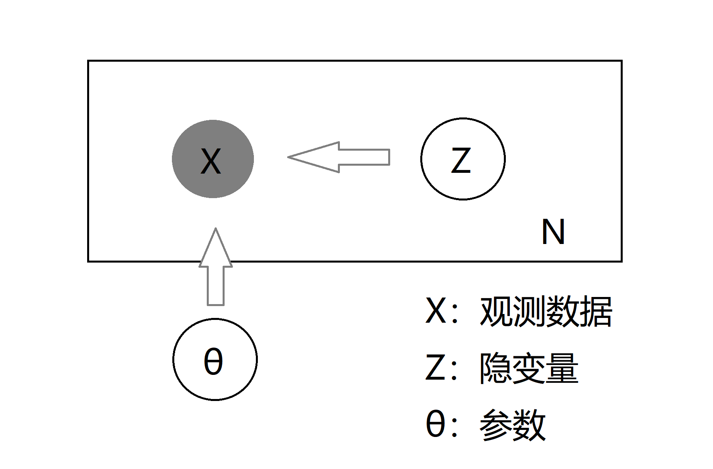

# FCM聚类算法
## 一、介绍
前面介绍的GMM和K-means聚类算法都可以看做用EM算法求解一个隐变量模型。FCM的出发点是改进K-means优化函数的形式，认为数据点不再是硬分配(hard assignment)取0或者1的形式，而是具有某种隶属度uij，
优化目标函数如下所示：

优化变量为均值vj和隶属度uij，其中uij的幂次m称为模糊系数(fuzzy coefficient)，和聚类数同为超参数。
FCM优化方式同样是交替优化，即固定一个变量优化另一个变量，交替进行至收敛，FCM每步优化和GMM一样都具有闭式解。

## 二、效果
### 1. 聚类个数为2， 模糊系数取3

### 2. 聚类个数为3， 模糊系数取3

# 三、总结
这里给出模糊系数m = 1情况下FCM的一个基于概率的生成式模型解释，概率图如下所示：

可以看到该概率图与K-Means和GMM的概率图相同，区别在于K-Means和GMM假设隐变量Zi, i=1, 2, ..., n之间是独立同分布的；FCM则认为
Zi之间独立但是服从不同的Categorical分布，Xi|Zi高斯分布的协方差矩阵都是一个相同的对角阵。

这样的话，就可以将FCM目标函数看作EM算法中的Q函数，交替优化就是EM算法的E步和M步。E步和M步分别对应着对隶属度进行优化和对每类均值进行优化。隶属度相当于对隐变量的后验概率。

FCM由于假设Zi之间独立但分布不相同，因此没法通过后验概率对新样本的类别进行推断，而GMM和K-means则可以通过求隐变量后验概率预测新样本的类别。
此外FCM的参数个数随着观测数据的增加而线性增加，从而增加计算的复杂度，这也是FCM的一个缺点。

# 四、参考资料
1. [https://zhuanlan.zhihu.com/p/85244505](https://zhuanlan.zhihu.com/p/85244505)

