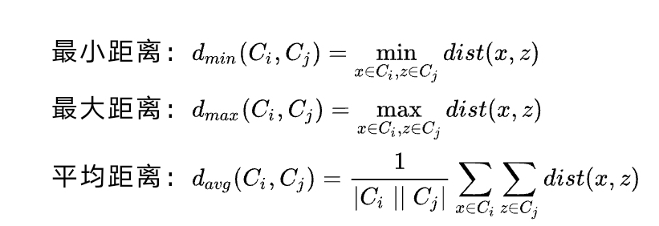
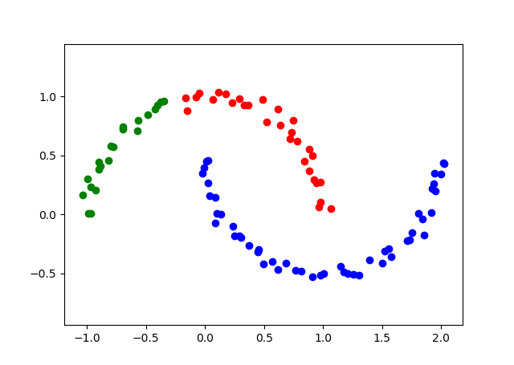
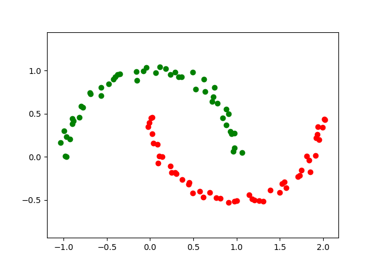

# 层次聚类(Hierachical clustering)算法
## 一、介绍
层次聚类试图在不同层次对数据集进行划分，从而形成树形的聚类结构。数据集划分可采用“自底向上”的聚合策略，也可采用“自顶向下”的分拆策略。
“自底向上”的层次聚类算法将N个数据初始化为N个团簇(cluster)，即每个数据点都是一个团簇，并用一个N * N矩阵储存两两团簇之间的距离信息(称为距离矩阵)。
接着每一步迭代将距离最近的两个团簇合并，并且更新距离矩阵，计算新团簇到旧团簇之间的距离，直到最后剩下K个团簇。一般来说，计算团簇之间距离有以下三种：

采用最小距离，最大距离，平均距离作为聚类簇距离时，分别称为单连接(single-linkage)、全连接(complete-linkage)、均连接(average-linkage)聚类，这里测试单连接聚类的效果。

## 二、效果
### 1. 聚类数为3

### 2. 聚类数为2

# 三、总结
可以看到当聚类数取2时，层次聚类完美地分离了数据。这里也可以看到层次聚类的优势，用以概率为基础的生成式模型进行聚类，总需要假设数据服从某种分布，
而当数据不服从该分布时聚类效果就会很差。相比之下，层次聚类更像是一种基于规则的聚类方法，通过合并最近邻团簇的规则实现聚类，
对于未知分布的数据也能有较好的效果。

# 四、参考资料
1. [website](https://baike.baidu.com/item/%E5%B1%82%E6%AC%A1%E8%81%9A%E7%B1%BB)
