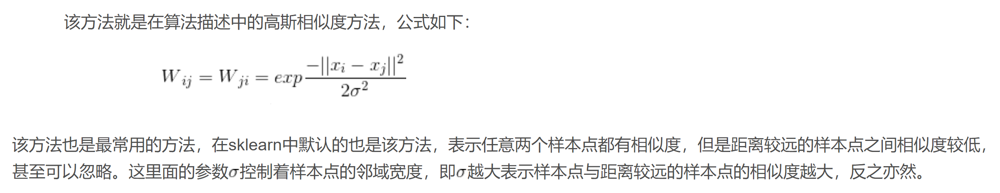

# 谱聚类(Spectral clustering)算法
## 1. 介绍
谱聚类基于图论中无向带权图的切图，一个无向带权图可以表示成G = (V, E, W)有序三元组的形式，其中V代表图中所有节点的集合，E代表所有边的集合，
W代表边上所有权重的集合(衡量的是相似度，即两个点的距离越远则权重越小)。

### 1.1 计算邻接矩阵(Adjacent matrix)
观测数据只是图上的顶点，首先需要给观测数据赋予图的拓扑结构，
或者说用某种规则计算图的邻接矩阵(Adjacent matrix)，这两者是等价的。
这里用三种方式计算邻接矩阵(又称为相似度矩阵)：近邻法(ε-neighborhood graph)，k近邻法(k-nearest nerghbor graph)，全连接法(fully connected graph)。

#### 1.1.1 ε-neighborhood graph

可以看到ε-neighborhood graph把带权图退化成无权图。

### 1.1.2 k-nearest nerghbor graph

### 1.1.3 fully connected graph

该方法认为数据构成的图是一张全连接图

## 1.2 Laplace矩阵

### 1.2.1 未标准化Laplace矩阵
图论中有四大矩阵：
1. Degree matrix D
2. Adjacent matrix W
3. Laplace matrix L
4. Incidence matrix A

其中 L = D - W = ATA，其中D是一个对角阵，对角元素等于W每行元素的和。考虑矩阵L的二次型：

且L**1** = **0** 由此得拉普拉斯矩阵是一个对称半正定矩阵。

### 1.2.2 标准化Laplace矩阵

标准化拉普拉斯矩阵有两种表示方法，1. 基于随机游走(Random Walk)的标准化拉普拉斯矩阵Lrw 2. 对称标准化拉普拉斯矩阵Lsym，
定义如下：

标准化后的laplace矩阵有如下性质:

不同版本谱聚类算法的区别在于相似度矩阵W的计算方式和拉普拉斯矩阵的计算方法，其它步骤基本相同。

## 1.3 谱聚类算法模板
n个样本点聚成k类：
1. 计算相似度矩阵W
2. 计算度矩阵D
3. 计算Laplace矩阵L(标准化或者非标准化)
4. 计算L的特征值，特征值从小到大排列，取前k个特征值对应的特征向量，构成Rn×k矩阵U
5. 使用K-means或其它聚类算法将U的每一行作为特征聚成k类

**注意**：最后一步用到的聚类算法可以是其它的聚类算法，具体根据实际情况而定。在sklearn中默认是使用KMeans算法，由于KMeans聚类对初始聚类中心的选择比较敏感，进而导致谱聚类算法不稳定，
在sklearn中有另外一个可选项是'discretize'，该算法对初始聚类中心的选择不敏感。

为什么可以用Laplace矩阵最小特征值对应的特征向量作为节点的特征进行聚类？回看1.2.1节Laplace矩阵的二次型，
考虑最小化该二次型，对于那些wij较大的点(即数据i和j的相似程度较高)，(xi-xj)2会较小，
所以如果最小化该二次型会趋向于给wij较小的两个数据点相近的xi和xj，xi和xj就可以用来作为原数据聚类的特征。
所以谱聚类可以理解为将高维空间的数据映射到低维，然后在低维空间用其它聚类算法（如KMeans）进行聚类。

## 2. 效果

经过试验，使用不同的laplace矩阵对聚类结果的影响并不大。这里采用全连接图，未归一化的Laplace矩阵。

#### 1. variance = 1， K = 2

#### 2. variance = 0.1， K = 3

##  3. 总结
1. 谱聚类是一种用Laplace矩阵较小特征值对应的特征向量作为特征进行聚类的算法。相当于将原数据映射到了一个低维的嵌入空间中，
因此谱聚类适合用于高维数据的聚类。
2. 当聚类类别多的时候不建议使用谱聚类。
3. 谱聚类对相似度矩阵的改变和方差的改变十分敏感，往往需要调参。
4. 谱聚类适合用于均衡分类问题，即各簇之间的点数差别不大。

##  4. 参考资料
1. [A Tutorial on Spectral Clustering](http://yaroslavvb.com/papers/luxburg-tutorial.pdf)

